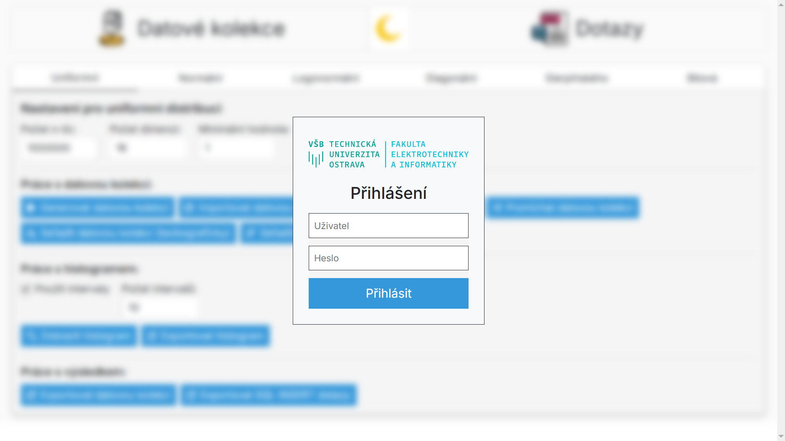
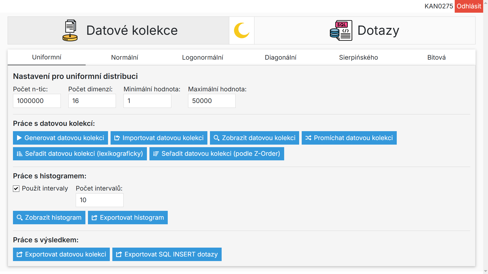
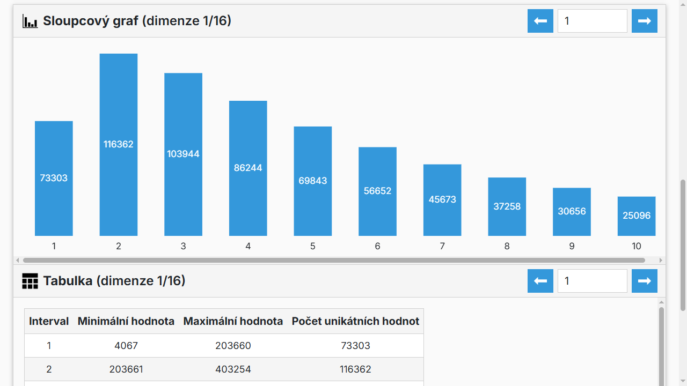
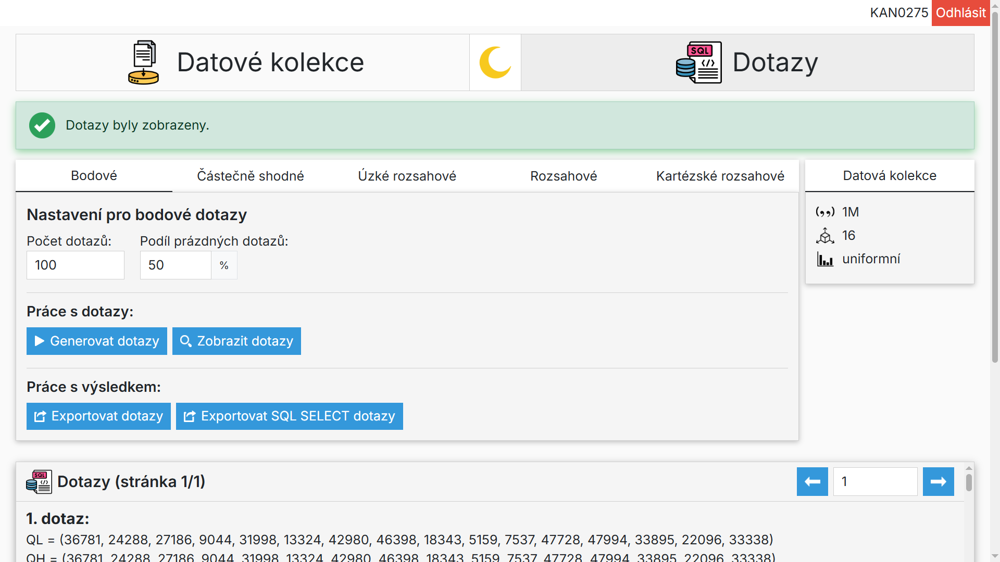

# Data Collection & Query Generator

Web application for generating data collections, query collections and statistical functions.

---

## 📌 Overview

This project builds upon an existing tool for generating data collections and queries from a previous student's work. It was developed as my bachelor thesis at VŠB-TUO. It fixes performance and stability issues, adds support for generating query collections from decimal data collections, and provides a user-friendly Blazor Server GUI.

---

## ⚡ Performance Optimizations

The core C++ library has been optimized with batch-based reading/writing, virtual memory mapping for efficient sorting and import of data collections, parallel sorting, and caching of computed results (histograms and sorted data collections).

---

## 🛠 Tech Stack

- **Frontend:** Blazor Server · Bootstrap · HTML · CSS · JavaScript
- **Backend:** C# · .NET
- **Core library:** C++ (wrapped with SWIG)
- **Build:** Microsoft Build Engine
- **IDE:** Microsoft Visual Studio

---

## 📸 Screenshots

---

## 🚀 Features

- Authentication with university LDAP server
- Import data collections
- Generate data collections (uniform, normal, lognormal, diagonal, Sierpiński, bit)
- Generate query collections (point, partial match, narrow range, range, cartesian range)
- Generate & visualize histograms
- Sort & shuffle data collections
- Export to files (`.ctf` for data collections, `.qtf` for query collections, `.txt` for histograms, `.sql` for SQL INSERT queries and SQL SELECT queries)
- Real-time progress bar for long operations
- Pagination for large collections and histograms (to prevent browser overload)
- Toggle for dark/light theme
